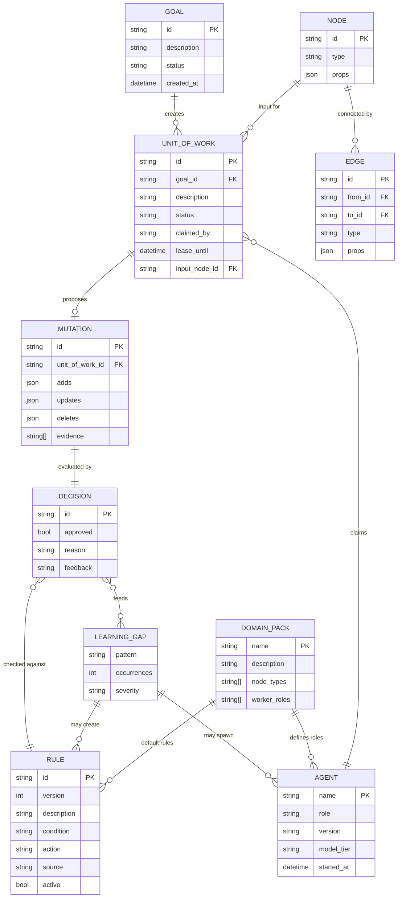
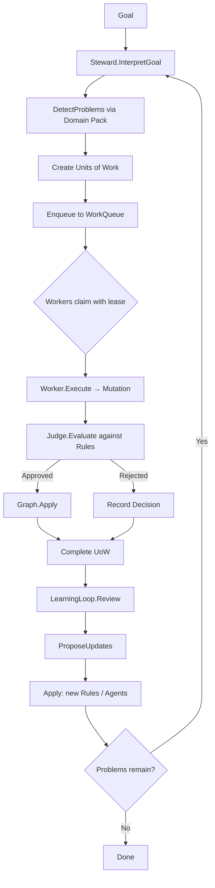
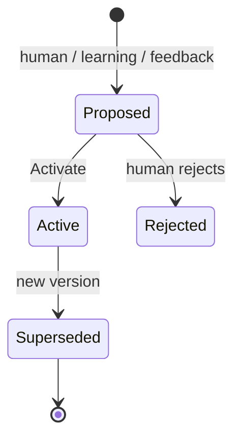
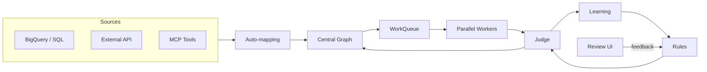

# Agent Factory — Entity Relationship & Flow Diagrams

## Core Entities

```mermaid
erDiagram
    GOAL ||--o{ UNIT_OF_WORK : "creates"
    UNIT_OF_WORK ||--o| MUTATION : "proposes"
    MUTATION ||--|| DECISION : "evaluated by"
    DECISION }o--|| RULE : "checked against"
    DECISION }o--o{ LEARNING_GAP : "feeds"
    LEARNING_GAP ||--o{ RULE : "may create"
    LEARNING_GAP ||--o{ AGENT : "may spawn"
    AGENT ||--o{ UNIT_OF_WORK : "claims"
    NODE ||--o{ UNIT_OF_WORK : "input for"
    NODE ||--o{ EDGE : "connected by"
    DOMAIN_PACK ||--o{ AGENT : "defines roles"
    DOMAIN_PACK ||--o{ RULE : "default rules"

    GOAL {
        string id PK
        string description
        string status
        datetime created_at
    }
    UNIT_OF_WORK {
        string id PK
        string goal_id FK
        string description
        string status
        string claimed_by
        datetime lease_until
        string input_node_id FK
    }
    NODE {
        string id PK
        string type
        json props
    }
    EDGE {
        string id PK
        string from_id FK
        string to_id FK
        string type
        json props
    }
    MUTATION {
        string id PK
        string unit_of_work_id FK
        json adds
        json updates
        json deletes
        string[] evidence
    }
    DECISION {
        string id PK
        bool approved
        string reason
        string feedback
    }
    RULE {
        string id PK
        int version
        string description
        string condition
        string action
        string source
        bool active
    }
    AGENT {
        string name PK
        string role
        string version
        string model_tier
        datetime started_at
    }
    LEARNING_GAP {
        string pattern
        int occurrences
        string severity
    }
    DOMAIN_PACK {
        string name PK
        string description
        string[] node_types
        string[] worker_roles
    }
```

## Continuous Swarm Flow

```mermaid
flowchart TD
    A[Goal] --> B[Steward.InterpretGoal]
    B --> C[DetectProblems via Domain Pack]
    C --> D[Create Units of Work]
    D --> E[Enqueue to WorkQueue]
    E --> F{Workers claim with lease}
    F --> G[Worker.Execute → Mutation]
    G --> H[Judge.Evaluate against Rules]
    H -->|Approved| I[Graph.Apply]
    H -->|Rejected| J[Record Decision]
    I --> K[Complete UoW]
    J --> K
    K --> L[LearningLoop.Review]
    L --> M[ProposeUpdates]
    M --> N[Apply: new Rules / Agents]
    N --> O{Problems remain?}
    O -->|Yes| B
    O -->|No| P[Done]
```

## Rule Versioning

```mermaid
stateDiagram-v2
    [*] --> Proposed: human / learning / feedback
    Proposed --> Active: Activate
    Active --> Superseded: new version
    Superseded --> [*]
    Proposed --> Rejected: human rejects
```

## Data Flow (any domain)

```mermaid
flowchart LR
    subgraph Sources
        BQ[BigQuery / SQL]
        API[External API]
        MCP[MCP Tools]
    end
    Sources --> Mapping[Auto-mapping]
    Mapping --> Graph[Central Graph]
    Graph --> Queue[WorkQueue]
    Queue --> Workers[Parallel Workers]
    Workers --> Judge
    Judge --> Graph
    Judge --> Learning
    Learning --> Rules
    Rules --> Judge
    UI[Review UI] -->|feedback| Rules
```
